# Sistem Informasi Academic - Nusantara Tech (ADSIS - CB2)

**Oleh:** Kelompok 2

**Mata Kuliah:** Administrasi Sistem

**Studi Kasus:** Standardisasi Infrastruktur menggunakan Orkestrasi Docker

---

## 1. Penjelasan Proyek
Proyek ini adalah aplikasi Sistem Informasi Akademik berbasis web yang mengimplementasikan konsep **Containerization**. Tujuan utama proyek ini adalah membangun lingkungan pengembangan (*development environment*) yang seragam, terisolasi, dan mudah direplikasi, sehingga menghilangkan masalah umum *"It works on my machine"* akibat perbedaan OS antar-developer.

Aplikasi ini mendukung fungsionalitas CRUD (Create, Read, Update, Delete) untuk data teks mahasiswa dan juga integrasi unggah/hapus berkas dokumen mahasiswa. Seluruh layanan diorkestrasi dalam satu jaringan Docker khusus bernama `adsis_cb2_network`.

---

## 2. Tech Stack yang Digunakan
* **Backend App:** Laravel (PHP), Blade Templating
* **Web Server:** Nginx
* **Database:** MySQL 8.0
* **Object Storage:** MinIO (Alternatif Lokal AWS S3)
* **Database GUI:** phpMyAdmin
* **Infrastruktur:** Docker & Docker Compose
* **Library Tambahan:** `league/flysystem-aws-s3-v3` (S3 Driver untuk Laravel)

---

## 3. Prasyarat Sistem (*Prerequisites*)
* **Docker Desktop** terinstal dan berjalan (gunakan integrasi WSL2 untuk Windows).
* Pastikan port **80, 3306, 9000, 9001, dan 8080** tidak sedang digunakan oleh aplikasi lokal lainnya (matikan XAMPP/Laragon jika ada).

---

## 4. Langkah-Langkah Instruksi Setup & Build Environment

Berikut adalah langkah-langkah komprehensif dari awal hingga aplikasi siap digunakan:

### Langkah 1: Kloning & Inisialisasi Environment Variabel
1. Gandakan *file* konfigurasi dasar (*environment*):
   ```bash
   cp .env.example .env
   ```
2. Buka file `.env` dan sesuaikan kredensial serta konfigurasi utama untuk Database dan MinIO:

   ```env
   DB_CONNECTION=mysql
   DB_HOST=adsis_cb2_db
   DB_PORT=3306
   DB_DATABASE=akademik_db
   DB_USERNAME=root
   DB_PASSWORD=rahasia_db_123

   FILESYSTEM_DISK=s3
   AWS_ACCESS_KEY_ID=admin_minio
   AWS_SECRET_ACCESS_KEY=rahasia_minio_123
   AWS_DEFAULT_REGION=ap-southeast-3
   AWS_BUCKET=akademik-bucket
   AWS_USE_PATH_STYLE_ENDPOINT=true
   AWS_ENDPOINT=http://minio:9000
   ```

### Langkah 2: Menyalakan Orkestrasi Docker Compose
Bangun citra (*build image*) dan jalankan seluruh kontainer layanan di latar belakang:

```bash
docker-compose up -d
```

### Langkah 3: Inisialisasi Dependensi dan Basis Data Laravel
Masuk ke dalam kontainer aplikasi `adsis_cb2_app` untuk memasang pustaka, kunci aplikasi, dan struktur tabel:

```bash
# Pemasangan dependensi PHP bawaan Laravel
docker exec -it adsis_cb2_app composer install

# Pemasangan driver AWS S3 agar Laravel dapat terhubung dengan MinIO
docker exec -it adsis_cb2_app composer require league/flysystem-aws-s3-v3

# Membuat application key Laravel baru
docker exec -it adsis_cb2_app php artisan key:generate

# Menjalankan migrasi struktur tabel database ke MySQL
docker exec -it adsis_cb2_app php artisan migrate
```

### Langkah 4: Konfigurasi Kebijakan Akses Object Storage (MinIO)
Agar berkas dokumen mahasiswa yang diunggah dapat dibaca oleh publik (aplikasi web), atur akses lewat MinIO Client (mc) via CLI:

```bash
# Daftarkan kredensial admin lokal ke dalam alias MinIO Client
docker exec -it adsis_cb2_minio mc alias set myminio http://localhost:9000 admin_minio rahasia_minio_123

# Ubah kebijakan akses bucket 'akademik-bucket' menjadi publik (Download / Read-Only)
docker exec -it adsis_cb2_minio mc anonymous set download myminio/akademik-bucket
```

### Langkah 5: Pembersihan Cache Konfigurasi Laravel
Langkah wajib untuk memastikan seluruh perubahan environment variable terbaru dari `.env` dimuat penuh oleh kontainer dan menghindari error 504 Gateway Timeout:

```bash
docker exec -it adsis_cb2_app php artisan config:clear
```

---

## 5. Panduan Akses Layanan (URL & Port)
Setelah semua tahapan di atas selesai dieksekusi, layanan terintegrasi dapat diakses menggunakan browser:

* **Aplikasi Web CRUD Akademik:** [http://localhost](http://localhost) (Port 80)
* **phpMyAdmin (Manajemen DB):** [http://localhost:8080](http://localhost:8080) (Port 8080)
* **MinIO Dashboard (Storage):** [http://localhost:9001](http://localhost:9001) (Port 9001)

---

## 6. Cara Menonaktifkan Layanan (Shutdown Environment)
Untuk menghentikan semua kontainer layanan dengan aman tanpa kehilangan persistensi data teks (MySQL) maupun data fisik (MinIO):

```bash
docker-compose down
```
*Peringatan Keamanan: Jangan menambahkan opsi flag `-v` saat mematikan layanan kecuali Anda benar-benar ingin menghapus volume database secara permanen.*

---

## 7. Lampiran Bukti Validasi Pengujian Terintegrasi

Berikut adalah dokumentasi visual dari sistem yang telah dibangun:

### 7.1. Tampilan Aplikasi & Database
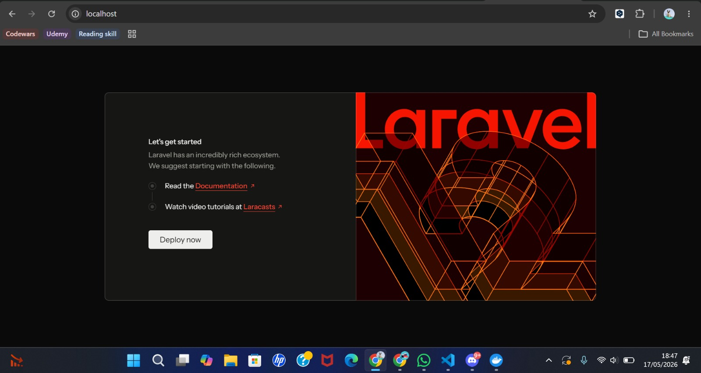
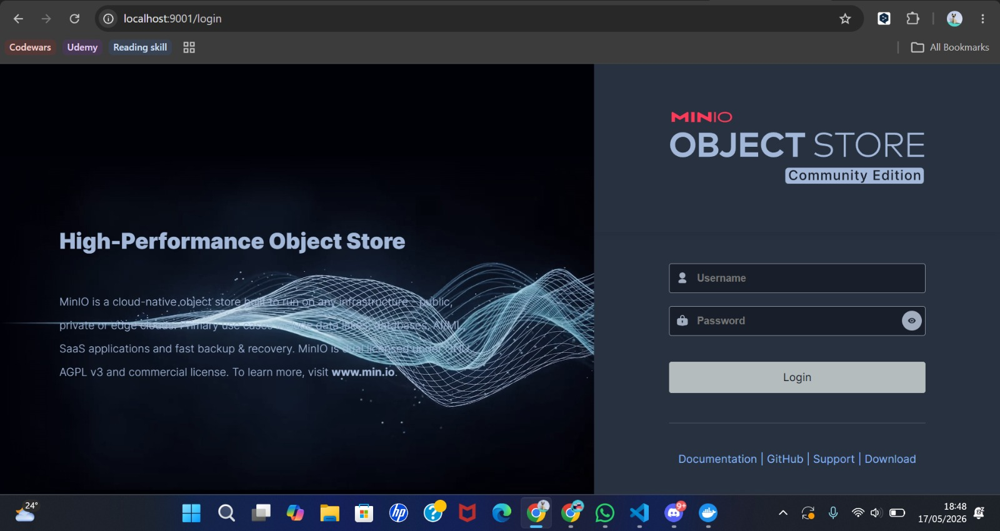
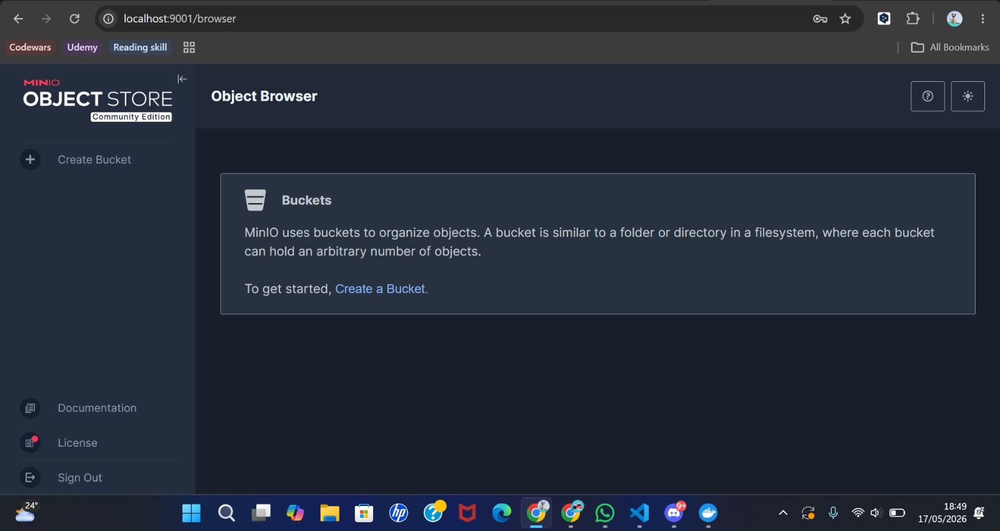
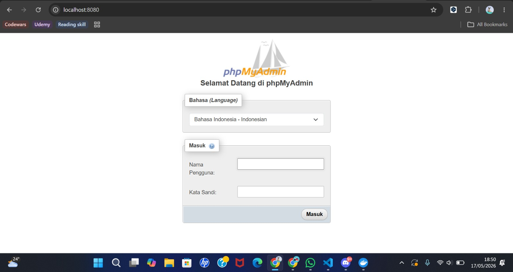
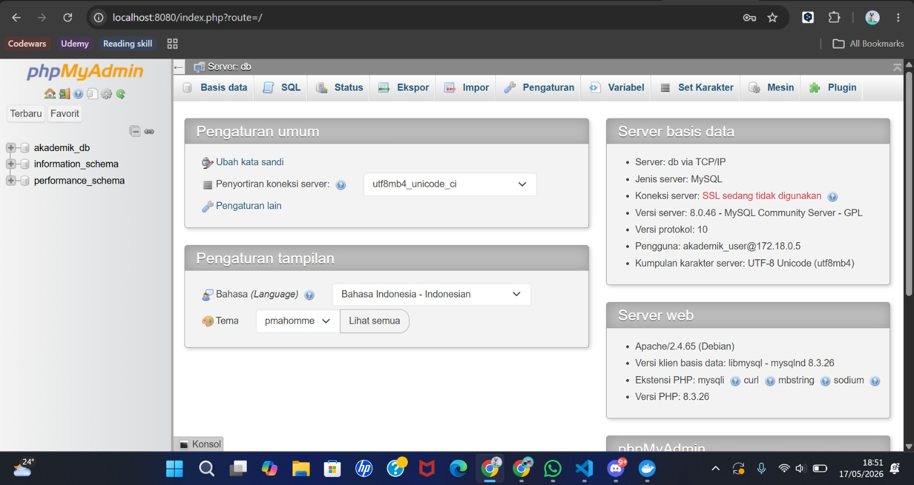
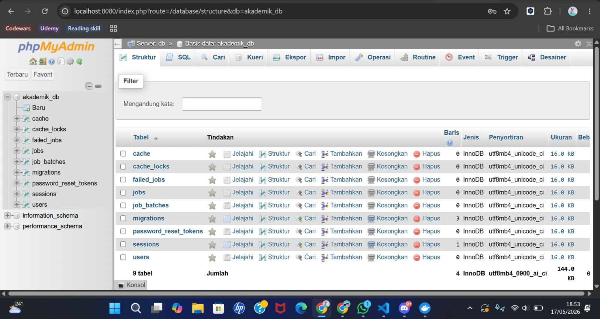
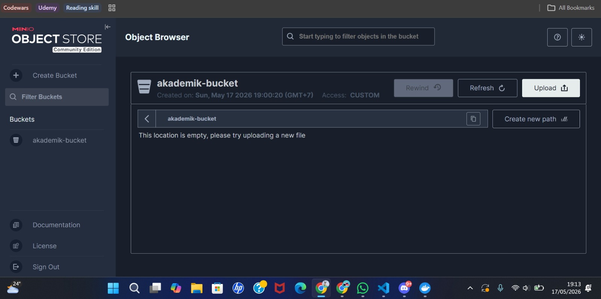
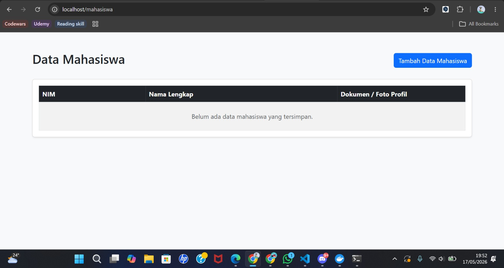
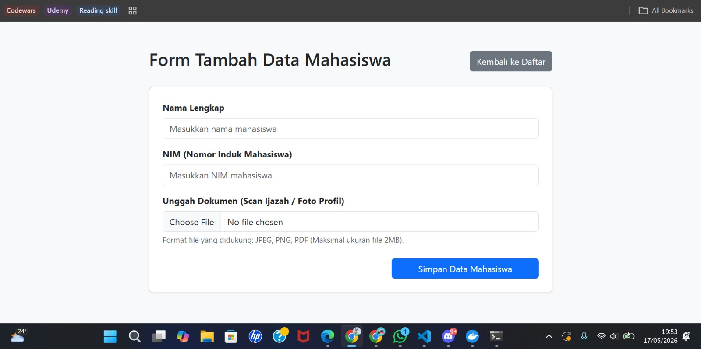

### 7.2. Integrasi Storage & Pengujian Lanjutan
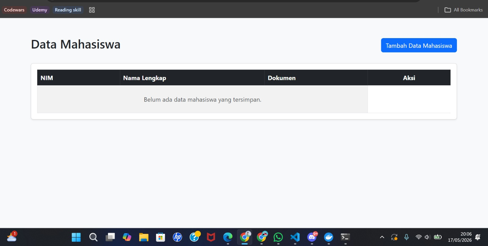
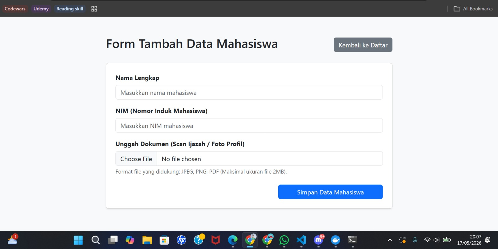
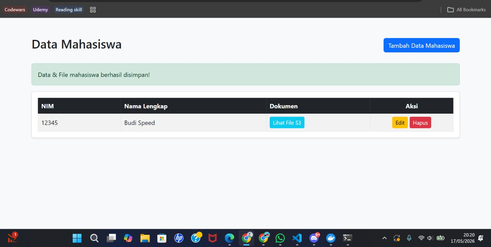
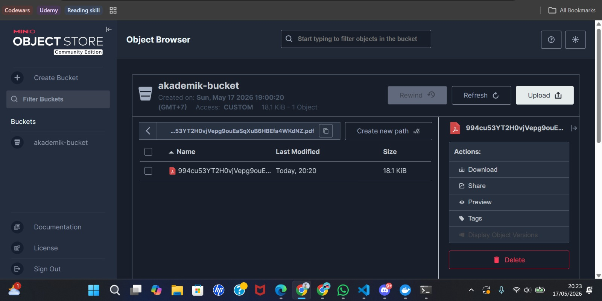
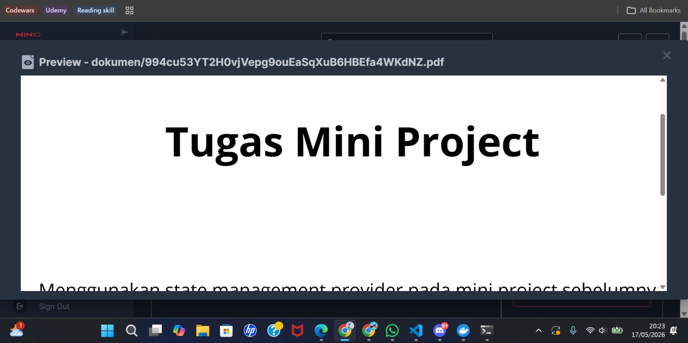
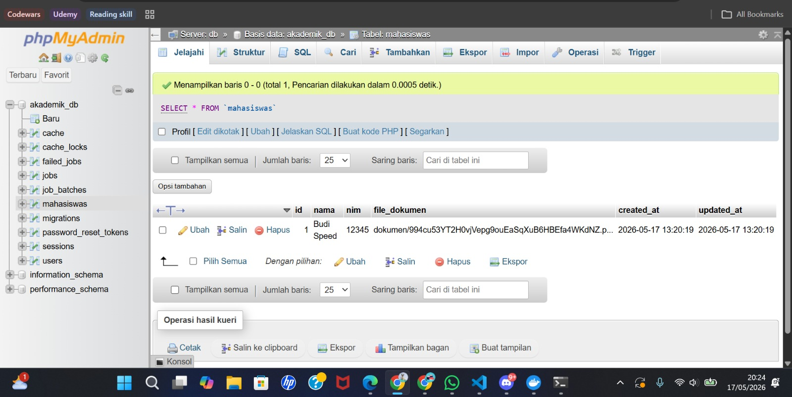
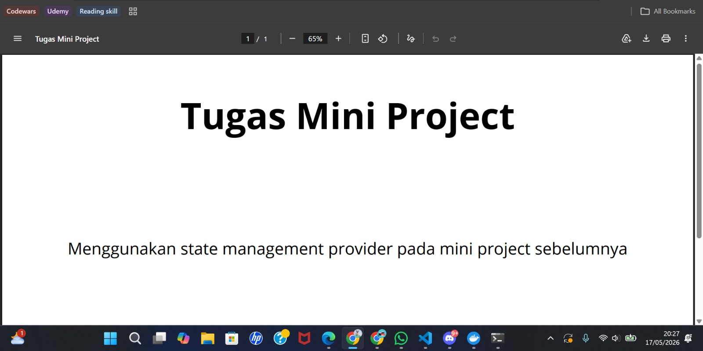
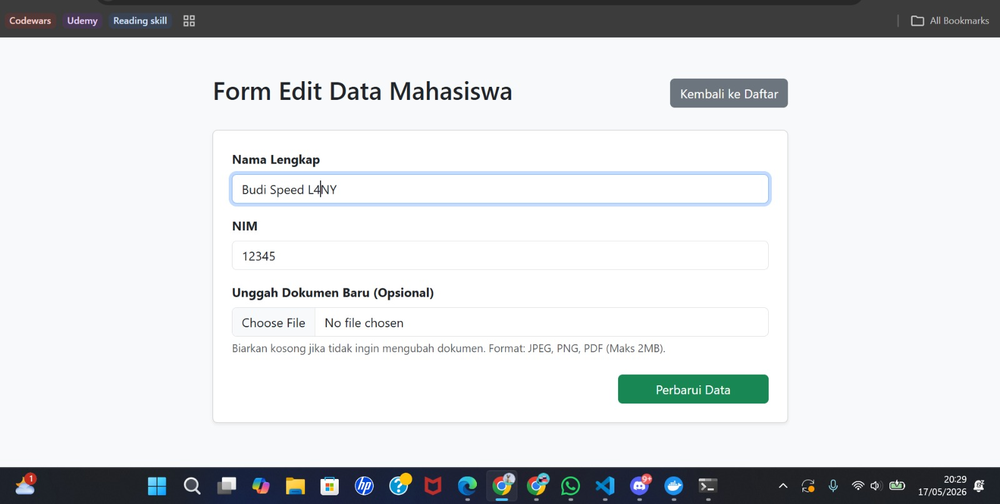
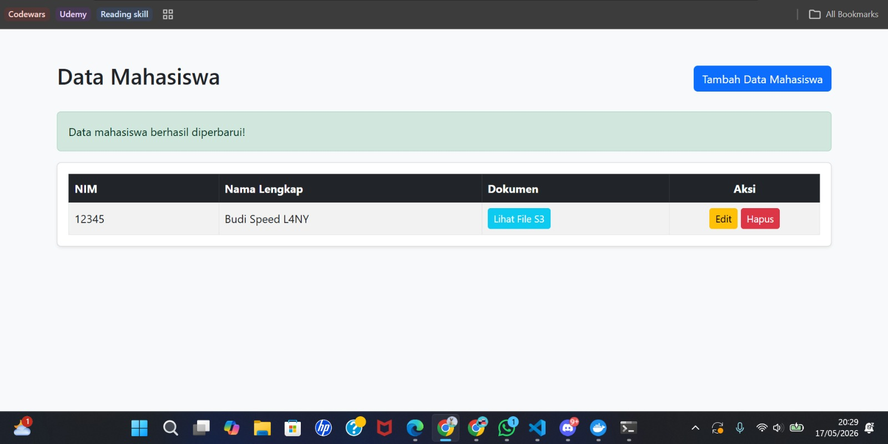
